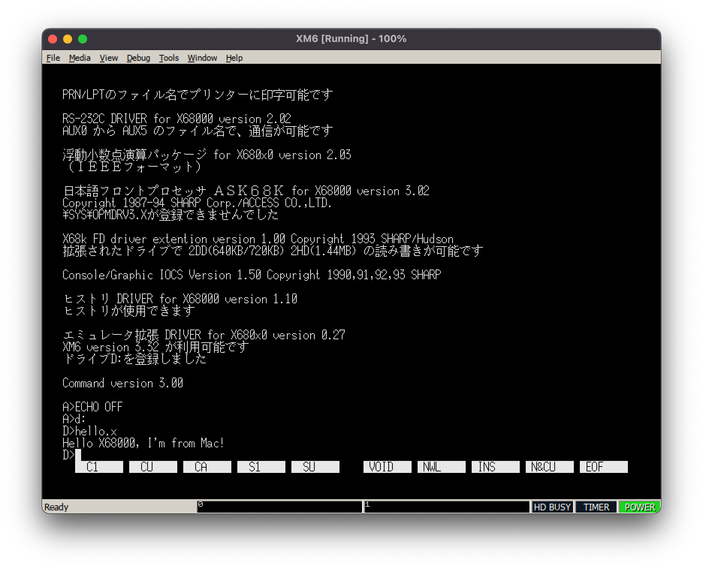
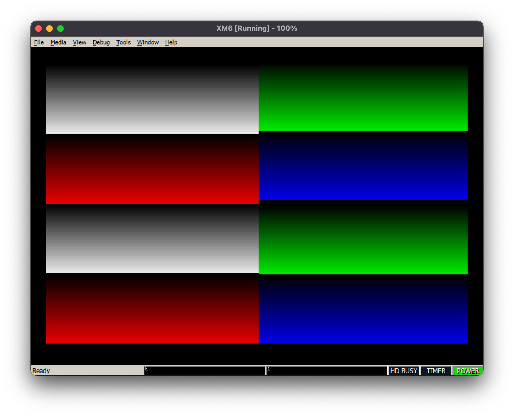

# X68000 cross compile examples

## Prereq

* Set up and build a cross compile toolset written in <https://virtuallyfun.com/wordpress/2014/11/18/cross-compiling-to-the-sharp-x68000/>
* It doesn't build gcc/binutils or etc on Apple Silicon in aarch64 mode. Please run `arch -x86_64 /bin/zsh` before building it.

```sh
# if aarch64
arch -x86_64 /bin/zsh

# common
brew intall llvm
export PATH="/usr/local/opt/llvm/bin:$PATH"
export LDFLAGS="-L/usr/local/opt/llvm/lib"
export CPPFLAGS="-I/usr/local/opt/llvm/include"

export HUMAN68K_TC=$HOME/Emu/x68000/cross/human68k
export HUMAN68K_TC_SRC=$HUMAN68K_TC/src
export PATH=$PATH:$HUMAN68K_TC/bin

if [ -d $HUMAN68K_TC_SRC ]; then
mkdir $HUMAN68K_TC $HUMAN68K_TC_SRC
fi

cd $HUMAN68K_TC_SRC
git clone git@github.com:Lydux/binutils-2.22-human68k.git
mkdir binutils-build
cd binutils-build
../binutils-2.22-human68k/configure --prefix=$HUMAN68K_TC --target=human68k --disable-nls --disable-werror
make all install -j16


cd $HUMAN68K_TC_SRC
git clone git@github.com:Lydux/gcc-4.6.2-human68k.git
mkdir gcc-build
cd gcc-build
../gcc-4.6.2-human68k/configure \
        --prefix=$HUMAN68K_TC \
        --target=human68k \
        --disable-nls \
        --disable-libssp \
        --with-newlib \
        --without-headers \
        --enable-languages=c \
        --disable-werror \
        --with-gmp=/usr/local/Cellar/gmp/6.2.1_1 --with-mpfr=/usr/local/Cellar/mpfr/4.1.0 --with-mpc=/usr/local/Cellar/libmpc/1.2.1
make all install -j16


cd $HUMAN68K_TC_SRC
git clone git@github.com:Lydux/newlib-1.19.0-human68k.git
mkdir newlib-build
cd newlib-build
../newlib-1.19.0-human68k/configure --prefix=$HUMAN68K_TC --target=human68k  --disable-werror
make all install -j16


cd $HUMAN68K_TC_SRC
git clone git@github.com:Lydux/gdb-7.4-human68k.git
mkdir gdb-build
cd gdb-build
../gdb-7.4-human68k/configure --prefix=$HUMAN68K_TC --target=human68k --disable-nls --disable-werror
make all install -j16
```

* When you `configure` each of them, you may need to add `--disable-werror`
* You'll get the fllowings for human68k/x68000
  * gcc
  * binutils
  * newlib
  * gdb
* Copy libc headers
    * Copy [libc32b](http://retropc.net/x68000/software/develop/lib/libc1132a/) into $(HOME)/Emu/x68000/cross/libc32b

## Build and run samples

### hello

* cd hello
* make install
* ~/tmp/hello.x is built
* run [XM6 TypeG](http://retropc.net/pi/xm6/index.html) via wine on Mac, configure WinDRV to share Mac's drive with the emulator
* mount ~/tmp in X68000 emulator as D: drive with WinDRV and run d:\hello.x



### vram

* vram access example


### asm

* assmebler + DOS call example
