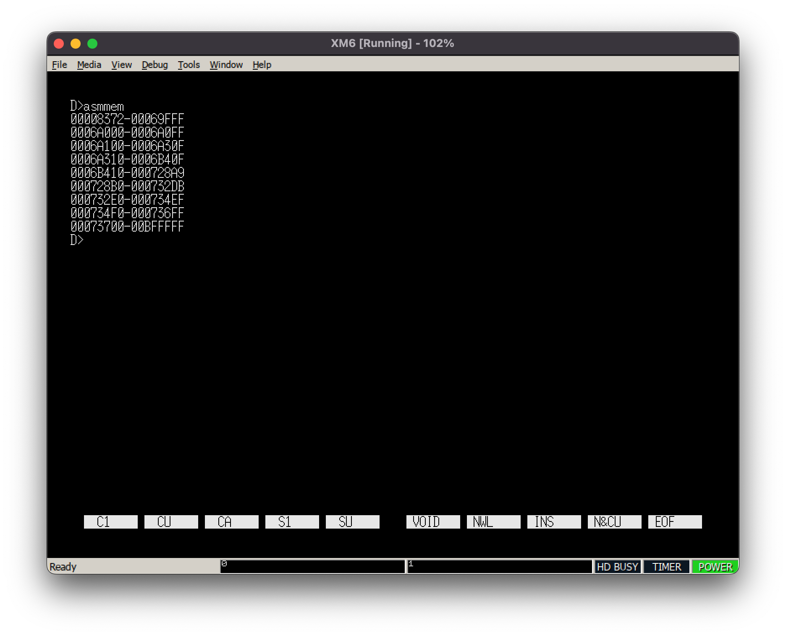
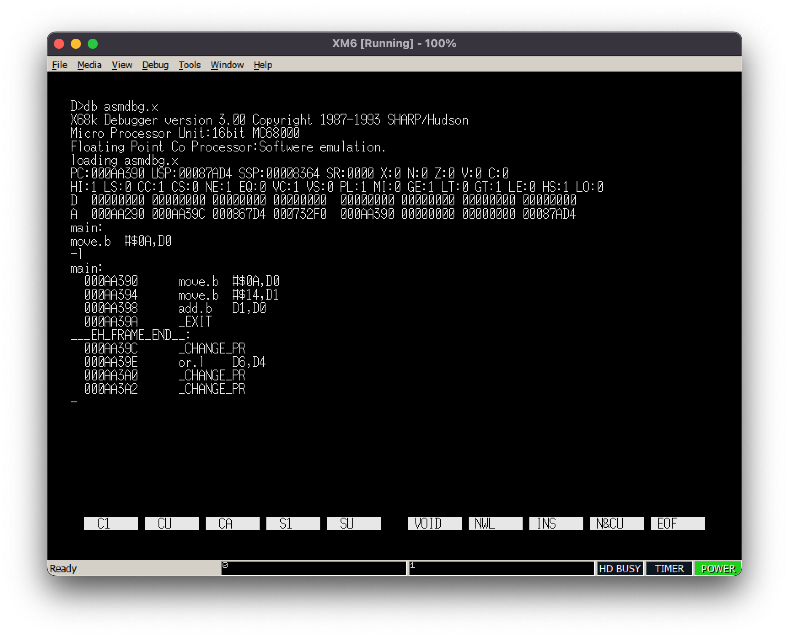

# X68000 cross compile examples

## Prereq

* Set up and build a cross compile toolset written in <https://github.com/yunkya2/elf2x68k>
* Make the following changes to compile elf2x68k before `make all` on macos 15 Sequoia

```sh
brew install texinfo gmp mpfr libmpc
```

  * modify scripts/binutils.sh

```
 41 ${SRC_DIR}/${BINUTILS_DIR}/configure \
 42     --prefix=${INSTALL_DIR} \
 43     --program-prefix=${PROGRAM_PREFIX} \
 44     --target=${TARGET} \
 45     --enable-lto \
 46     --enable-multilib \
 47 ▸   --with-gmp=/opt/homebrew/Cellar/gmp/6.3.0 \
 48 ▸   --with-mpfr=/opt/homebrew/Cellar/mpfr/4.2.1 \
 49 ▸   --with-mpc=/opt/homebrew/Cellar/libmpc/1.3.1
```

## Build and run samples

### common

* set the following 2 env vars

```bash
export XELF_BASE=/path/to/your/cloned/elf2x68k/m68k-xelf
export PATH=$XELF_BASE/bin:$PATH
```


### hello

* cd hello
* make install
* ~/tmp/hello.x is built


### vram

* vram access example


### asm-hello

* assmebler + DOS call example

### asm-memory

* print memory blocks


### asm-debug

* usage of DB.x debugger

```
# when we debug the following code (asmdbg.x) with DB.x
main:
	move.b	#10, %d0
	move.b	#20, %d1
	add.b	%d1, %d0
	DOS	_EXIT


# it shows registers and the current instruction
> db asmdbg.x
D 00000000 00000000 00000000 00000000 00000000 00000000 00000000 00000000
A 00AA290 ...
main:
move.b #$0A, D0

# 'help' shows hep
- help
A[address]      : Assmeble
AN[address]     : Assemble w/o mnemoinic
B               : display breakpoints
...
L               : assembly list
P               : system status
PS              : symbols
...
S               : step
T               : trace
X               : registeres
...

# 'l' shows the current assmebly list
-l
...
main:
move.b #$0A, D0
move.b #$14, D1
...

# 'p' shows the program info
- p
Micro Processor Unit: 16bit MC68000
Floating Point Co Processor:Software emulation.
debug program from $00073800
user  program from $000AA390
              end  $000AA39C
              exec $000AA390
symbol table  from $000AA180


# 'ps' shows the symbols
- ps
$000AA390: main
$000AA39C: ___EH__FRAME_END__
$000AA39C: edata
$000AA39C: __dtors_end
$000AA39C: end
$000AA39C: etext
$000AA39C: __ctors_start
$000AA39C: _etext
$000AA39C: ___EH_FRAME_BEGIN__
$000AA39C: __dtors_start
$000AA39C: __dtors_end
$000AA39C: _edata
$000AA39C: _end


# 't' traces.
# D0 register changed to 0x0A by 'move.b #$0A, D0
- t
PC: 000AA394 USP:...
HI: 1 LS:0 CC:1 ...
D: 0000000A 00000000 00000000 00000000 00000000 00000000 00000000 00000000
A 000AA290 ...
move.b #$14 ,D1

-t
PC: 000AA398 USP:...
D: 0000000A 00000014 00000000 00000000 00000000 00000000 00000000 00000000
A 000AA290 ...
add.b D1, D0

-t
PC: 000AA39A USP:...
D: 0000001E 00000014 00000000 00000000 00000000 00000000 00000000 00000000
A 000AA290 ...
_EXIT

-t
program terminated normally

```


### asm-device

* Print installed device drivers

## Differences in GNU Assembler

* Add `--register-prefix-optional --traditional-format` to use Motolora syntax

| Item                   | X68000/Motolora Syntax | GNU `gas` Syntax |
|------------------------|-----------------|-----------------------|
| register               | `d1`            | `%d1`                 |
| indirect               | `(a0)`          | `%a0@`                |
| indirect pre-decrement | `-(sp)`         | `%sp@-`               |
| indirect post-increment| `(a0)+`         | `%a0@+`               |
| indirect plus offset   | `12(a0)`        | `%a0@(12)`            |

* Link: <https://sourceware.org/binutils/docs/as/index.html>

## Known items in elf2x68k.py

* `.stack` or any custom sections are not supported -> use `.bss` for stack
* `.align 2` is not supported -> manually align it
